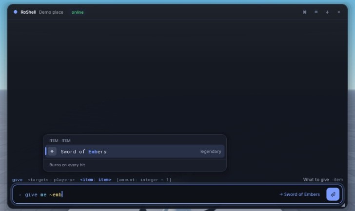
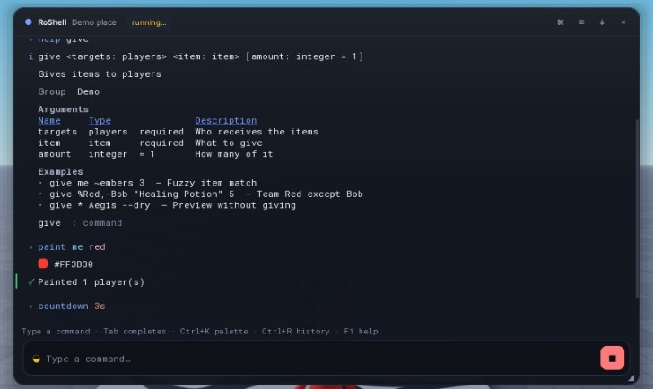
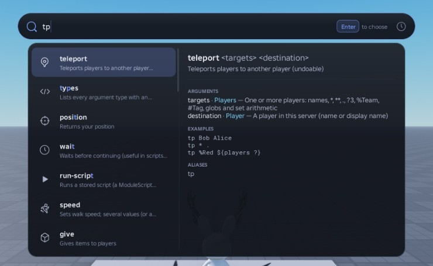
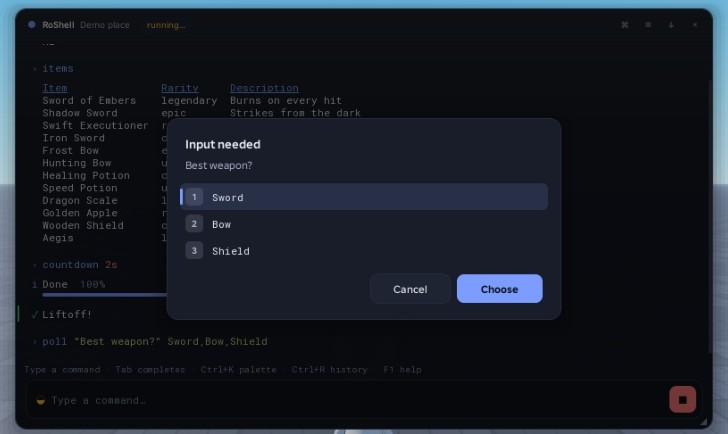
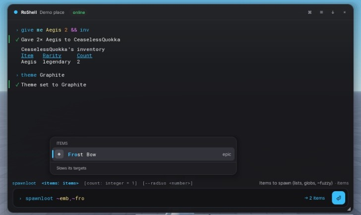

# RoShell

**A typed command console for Roblox.** Define commands once and get fully typed arguments, a real input language
(pipes, chains, wildcards, set arithmetic, variables, embedded commands), IDE-grade completion and a console UI that
feels like a modern command palette. A ground-up remake of [Cmdr](https://github.com/evaera/cmdr).



```lua
local RoShell = require(ReplicatedStorage.RoShell)

return RoShell.Command({
	Name = "give",
	Args = {
		{ targets = RoShell.Default(RoShell.Types.Players, "me") },
		{ item = RoShell.Arg(Items) },
		{ amount = RoShell.Default(RoShell.Types.Integer, 1) },
	},
}):Run(function(ctx, args)
	-- args.targets: { Player }   args.item: ItemDef   args.amount: number   (inferred, no annotations)
	return ctx:Success(`Gave {args.amount}× {args.item.Name}`)
end)
```

```
give %Red-Bob ~embers 3 && announce "Loot dropped!"
players --team Blue | kick --reason "friendly fire"
in 5m shutdown "Update!" --dry
```

## Highlights

- **Precise types end to end.** `Run(ctx, args)` receives a record computed from `Args` by Luau type functions:
  choices become literal unions, maps and dynamic types carry their value type, optionals are `T?`, rests are
  `{ T }`. Mistakes are compile errors (see `tests/types/negative`). No `any` anywhere in the library.
- **Custom types in a few lines.** `Type.Choice`, `Type.Map`, `Type.Dynamic`, `Type.Struct`, `Type.Union`,
  `Type.Transform`, `Type.Refine`, … and 40+ built-in types (players, teams, durations, colors, vectors, instances,
  enums, timestamps, …).
- **A real input language.** Quotes and escapes, `&&` `||` `;` `|`, `${embedded commands}`, `$variables`,
  `$functions()`, aliases with `$1…$9`, flags and named arguments, `--dry` previews and `--yes`. See
  [docs/GRAMMAR.md](docs/GRAMMAR.md).
- **Operators everywhere.** `*`, `**`, `.`, `?3`, `~fuzzy`, globs, `%Team`, `#Tag`, `a,b`, `a+b`, `a-b`, `a&b`,
  `!a`, parentheses and numeric ranges, for every enumerable type, including your own.
- **Completion that understands the line.** Works mid-text, inside quotes and `${…}`, after pipes; fuzzy ranking
  with highlights and frecency; ghost text; signature hints with the active argument; live validation; resolution
  previews (`→ 7 players`). 10 000 candidates complete in under 1 ms.
- **A console worth opening.** Six themes (contrast-audited), springs and tweens that respect reduced motion, a
  virtualized log with tables/lists/progress/colors, a command palette (Ctrl+K), fuzzy history search (Ctrl+R),
  prompts, toasts, docking, dragging, mobile chips and a touch button.
- **Secure by default.** Default-deny permissions (users, groups, roles, game passes, badges, predicates), the
  server re-parses every request, typed schema validation at the network boundary, rate limits, cooldowns and an
  audit log.
- **Batteries included.** 50+ built-in commands: help, aliases, binds, variables, history, undo/redo, scheduling
  (`in`, `every`, `repeat`), scripts, moderation, inspection, cross-server announcements, theme and settings.
- **Testable.** `RoShell.Test.Run({ Text = "give Bob sword" })` runs commands headlessly with a virtual clock and
  scripted prompt answers.

| | |
|---|---|
|  |  |
|  |  |

## Quickstart

Put RoShell in `ReplicatedStorage` (Wally, the `.rbxm` from the releases, or Rojo with `default.project.json`).

**Server** (a `Script`):

```lua
local RoShell = require(game.ReplicatedStorage.RoShell)
local server = RoShell.Server.new()
server.Registry:RegisterDefaultCommands()
server.Registry:RegisterCommandsIn(game.ReplicatedStorage.Commands)
server.Permissions:SetGroup("Admin", RoShell.Permissions.Users({ 156 }))
server:Start()
```

**Client** (a `LocalScript` in `StarterPlayerScripts`):

```lua
local RoShell = require(game.ReplicatedStorage:WaitForChild("RoShell"))
local client = RoShell.Client.new()
client.Registry:RegisterDefaultCommands()
client.Registry:RegisterCommandsIn(game.ReplicatedStorage:WaitForChild("Commands"))
client:Start()
```

Press **F2** or **`** to open the console. Commands are denied by default: grant groups with
`server.Permissions:SetGroup` (everything is allowed in Studio unless `StudioBypass = false`).

## Guides

- [Your first command](docs/guides/FirstCommand.md)
- [Custom types in 60 seconds](docs/guides/CustomTypes.md)
- [Operators and wildcards](docs/guides/Operators.md)
- [Permissions](docs/guides/Permissions.md)
- [The console: keys, settings, theming](docs/guides/Console.md)
- [Writing plugins and extending RoShell](docs/guides/Extending.md)
- [Security model](docs/guides/Security.md)
- [Testing commands](docs/guides/Testing.md)
- Reference: [input grammar](docs/GRAMMAR.md), [built-in commands, types and functions](docs/Reference.md)
  (generated by `RoShell.Docs.Markdown`), [benchmarks](docs/BENCHMARKS.md), [design notes](DESIGN_NOTES.md)
- Runnable [examples](examples/) and a [demo place](demo/) (`rojo serve demo.project.json`)

## Coming from Cmdr

| Cmdr v1 | RoShell |
|---|---|
| Definition module + separate `…Server` module | One module: `RoShell.Command({ … }):Run(fn)` (`:ClientRun(fn)` for client code) |
| `Args = { { Type = "player", Name = "target" } }` | `Args = { { target = RoShell.Arg(RoShell.Types.Player) } }`, typed in `Run` |
| `Optional = true`, `Default = …` | `RoShell.Optional(T)`, `RoShell.Default(T, value or "text")`, `RoShell.DefaultFn(T, fn)` |
| Type tables `{ Transform, Validate, Autocomplete, Parse }` | `RoShell.Type.Custom({ Parse, Complete })` or a constructor (`Choice`, `Map`, `Dynamic`, …) |
| `Util.MakeEnumType`, `MakeListableType`, `MakeFuzzyFinder` | `Type.Choice`, `Type.List`, fuzzy matching built into every enumerable type |
| `Registry:RegisterType("name", type)` | `Registry:RegisterType(type)` (the name comes from the type) |
| `Registry:RegisterHook("BeforeRun", fn)` | `Registry:RegisterHooks({ BeforeRun = fn })`, plus `RegisterMiddleware` |
| Group checks inside a `BeforeRun` hook | Default-deny `Permissions` per command or per group (`Permissions:SetGroup`) |
| `context:Reply(text, color)` | `ctx:Reply(text, level)`, `ctx:Success/Info/Warn/Error`, `ctx:Table/List/KeyValue/Color/Progress` |
| `Data = function(context, …)` | `:Data(fn)`; read with `ctx:GetData()` |
| `CmdrClient:HandleEvent(name, fn)` / `context:SendEvent` | `client:OnEvent(name, fn)` / `ctx:SendEvent(player, name, payload)` |
| `CmdrClient:SetActivationKeys`, `SetPlaceName`, `SetEnabled`, `Show/Hide/Toggle`, `SetMashToEnable`, `SetActivationUnlocksMouse`, `SetHideOnLostFocus` | Same names on `client` |
| `Cmdr.Dispatcher:EvaluateAndRun(text, player)` | `server:Run(text, player)` / `client:Run(text)` |
| `${…}`, `$1`, `alias`, `bind`, `var` | Same ideas, plus pipes, `&&`/`||`, `$$`, `$@`, `$fn()`, set operators and ranges |

## Development

Tools are pinned in `rokit.toml` (`rokit install`): Luau LSP, Larvae (formatter), selene, Rojo and the Luau CLI.

```bash
bash scripts/analyze.sh       # strict type check (new solver), zero errors
bash scripts/typetests.sh     # negative type tests: marked lines must fail
luau tests/cli.luau           # unit tests (headless)
luau --codegen tests/bench.luau
larvae fmt src tests demo examples
```

In Studio, `require(game.ServerStorage.RoShellDev.tests.Studio)()` runs the same suite plus the engine-only specs.

## License

MIT. RoShell is inspired by [Cmdr](https://github.com/evaera/cmdr) by evaera and contributors.
