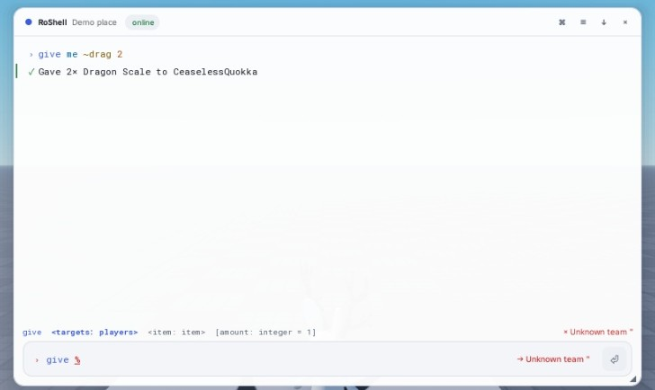

# The console

Open it with **F2** or **`** (configurable), the floating button on touch devices, or `client:Show()`.


## Anatomy

By default the console is **docked to the top of the screen** like Cmdr's: centered below Roblox's top bar, only as
tall as its output needs (just the input when the log is empty), growing up to 40% of the screen. `config dock
bottom` docks it to the bottom instead and `config dock float` makes it a free window.

- **Title bar** — place name, connection status (`online`, `running…`), buttons for the command palette (⌘),
  settings (≡), export (↓) and close (×). Drag it to move the window; dragging a docked console undocks it into a
  floating window, whose corner grip resizes it. The floating position and size are remembered.
- **Log** — every executed line (syntax highlighted) followed by its output: text with level icons and accent bars,
  tables, lists, key/value blocks, color swatches, links and live progress bars. Virtualized and pooled: thousands
  of rows cost nothing. Click a row to copy it. Hover shows its timestamp.
- **Signature bar** — `give <targets: players> <item: item> [amount: integer = 1]` with the argument under the
  caret highlighted, its description and type on the right, or the error at the caret.
- **Input** — syntax highlighting (commands, types, strings, operators, flags, variables, comments, errors), ghost
  text of the top suggestion, a preview chip with what the current argument resolves to (`→ 7 players`), and a run
  button that turns into a stop button while a command runs.
- **Suggestions** — fuzzy-ranked with highlighted matches, icons tinted by type, details on the right and the
  highlighted suggestion's description in the footer. On touch screens they appear as a row of chips.

## Keys

| Key | Action |
|---|---|
| `Tab` / `Shift+Tab` | Accept the highlighted (or top) suggestion; the first Tab completes a shared prefix; repeat to cycle |
| `→` / `End` at the end of the line | Accept the ghost text |
| `↑` / `↓` | Move through suggestions; history when the line is empty or you are already browsing history |
| `Enter` | Run (accepts the suggestion first if you picked one with the arrows). An invalid line shakes; press Enter again to send it anyway |
| `Esc` | Close suggestions → clear the line → close the console |
| `Ctrl+Space` | Show suggestions |
| `Ctrl+K` | Command palette: every command, action and theme, fuzzy searchable (`Shift+Enter` runs) |
| `Ctrl+R` | Fuzzy history search |
| `Ctrl+L` | Clear the log |
| `Ctrl+W`, `Alt+Backspace` | Delete the previous word |
| `Ctrl+←` / `Ctrl+→` | Jump by word |
| `Ctrl+Z` / `Ctrl+Shift+Z`, `Ctrl+Y` | Undo / redo edits of the line |
| `Ctrl+C` | Cancel the running command (copies instead when text is selected) |
| `F1`, or `?` on an empty line | Help for the command being typed |

Every binding can be remapped (whole actions are replaced):

```lua
RoShell.Client.new({
	Keymap = {
		Palette = { { Key = Enum.KeyCode.P, Ctrl = true, Shift = true } },
		HistorySearch = { { Key = Enum.KeyCode.H, Ctrl = true } },
	},
})
```

A focused `TextBox` still reports keys to `UserInputService` (marked as processed), so bindings work while typing;
`Tab` never inserts a tab character, and `Enter`/`Esc` give focus back to the input automatically. An activation
key held with a modifier types its character (Shift+` is `~`) instead of toggling the console.

## Client options

```lua
RoShell.Client.new({
	ActivationKeys = { Enum.KeyCode.F2 },
	MashToEnable = false,            -- require 5 quick presses before the console can open
	HideOnLostFocus = true,          -- clicking outside closes it
	ActivationUnlocksMouse = true,   -- free the mouse in first-person games
	TouchButton = true,              -- floating button on touch/gamepad devices
	PlaceName = "Lobby",
	Settings = { theme = "Graphite", dock = "top" },   -- defaults for players who never changed them
	Interface = true,                -- false: no UI (commands and binds still work)
})
```

`client:Show()`, `Hide()`, `Toggle()`, `SetEnabled(bool)`, `SetActivationKeys(keys)`, `SetPlaceName(name)`,
`SetTheme(name)`, `OnEvent(name, fn)`, `GetHistory()` and the `Toggled`/`Executed` signals are available at runtime.

## Settings

Players change settings with `config <key> <value>` (keys and values complete) or the settings button. They are
saved per player through the server's storage adapter.

| Key | Values | Default |
|---|---|---|
| `theme` | Midnight, Graphite, Light, HighContrast, Solarized, Mocha, or any registered theme | Midnight |
| `density` | comfortable, compact | comfortable |
| `textScale` | 0.75 – 1.75 | 1 |
| `dock` | top, bottom, float | top |
| `reduceMotion` | true / false (also follows the system's reduced-motion setting) | false |
| `blur` | blur the game behind the console | false |
| `timestamps` | show a time on every log row | false |
| `opacity` | 0.5 – 1 | 0.97 |
| `ghostText` | inline completion preview | true |
| `autoPair` | insert closing quotes and `}` | false |
| `maxLog` | rows kept, 100 – 5000 | 1000 |

## Themes

Six presets ship: **Midnight** (default), **Graphite**, **Light**, **HighContrast**, **Solarized** and **Mocha**.
Every text color in every preset reaches a 4.5:1 contrast ratio against the surfaces it is drawn on (checked by
`tests/unit/ThemeSpec.luau`).



Create your own from a base; anything not overridden is inherited:

```lua
RoShell.Theme.Create({
	Name = "Ocean",
	Base = "Midnight",
	Overrides = {
		Accent = "#3DD6D0",
		BorderFocus = "#3DD6D0",
		Syntax = { Command = "#3DD6D0", String = "#A6E3A1" },
		Types = { Player = "#7DD3FC" },
	},
})
-- then: theme Ocean, config theme Ocean, client:SetTheme("Ocean"), or Settings = { theme = "Ocean" }
```

Tokens: surfaces (`Window`, `Elevated`, `Input`, `Hover`, `Selected`), borders (`Border`, `BorderFocus`), text
(`Text`, `TextSecondary`, `TextMuted`, `TextInverse`), `Accent`/`AccentHover`, `Success`/`Warning`/`Error`/`Info`,
`Shadow`, syntax colors (`Command`, `Argument`, `Number`, `String`, `Operator`, `Flag`, `Variable`, `Comment`,
`Error`) and type badge colors (`Player`, `Team`, `Number`, `String`, `Boolean`, `Instance`, `Color`, `Enum`,
`Command`, `Variable`, `Default`). Use `RoShell.Theme.Audit(definition)` to check a custom theme's contrast.

## Motion

Opening slides, scales and fades the window; the suggestion list scales in with staggered rows and a highlight
that springs between rows; new log rows fade in; toasts slide; the caret glides. Nothing blocks input, and
everything snaps instantly with reduced motion (`reduceMotion` setting, the `ReduceMotion` system setting, or
`RoShell.Client.new({ Settings = { reduceMotion = true } })`).

## Touch and gamepad

On touch devices the console stays docked (above the on-screen keyboard) with larger targets, suggestions become
tappable chips above the input, and a draggable floating button opens it. Gamepad users can open it with the same button; D-pad up/down move through
suggestions, R1/L1 accept.
