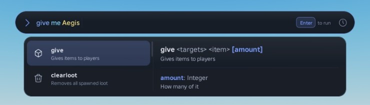
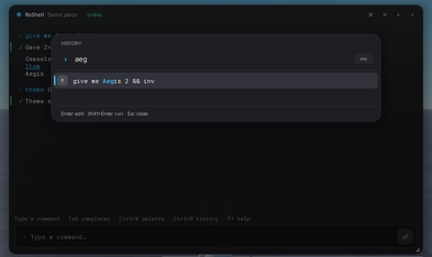
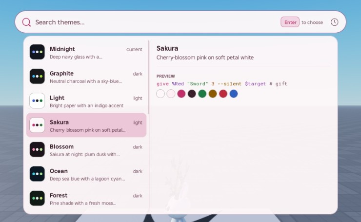
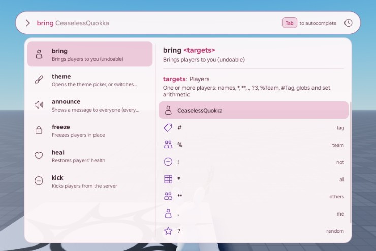

# The console

Open it with **F2** or **`** (configurable), the floating button on touch devices, or `client:Show()`.


## Anatomy

The console is a **command bar** — a pill docked to the top of the screen, below Roblox's top bar — and a
**panel** that pops out of it only when there is something to show. Nothing else stays on screen.

- **Bar** — the prompt icon (drag it to move the bar), the input with syntax highlighting (commands, types,
  strings, operators, flags, variables, comments, errors) and ghost text of the highlighted suggestion (what Tab
  would put in), a key hint on the right (`Tab` to autocomplete, `Enter` to run, `Ctrl C` to stop, or the error under the caret), and the history
  button (a dot appears when output arrived while something else was showing). On touch screens a run/stop button
  replaces the key hint.
- **Panel while typing** — the matching commands on the left while the command is typed, then just that command;
  on the right its signature with the argument being typed, that argument's type and description, what the current
  value resolves to (`→ 3 players`), a line about the highlighted candidate, and the argument's candidates.
  Choosing a command shows its arguments, examples and aliases instead. Narrow screens show one column. The
  keyboard owns the highlight; the mouse only tints the row under it, so scrolling never moves anything.
- **Panel after running** — just that command's output: text with level icons, tables, lists, key/value blocks,
  color swatches, links and live progress bars. Click a row to copy it.
- **History** — the history button or `Ctrl+H` shows the whole log (virtualized: thousands of rows cost nothing).
- **Prompts** (`ctx:Confirm`, `ctx:Choose`, `ctx:Input`), **pickers** (command palette, history search, themes,
  settings) and copyable text appear in the panel too. A picker turns the bar's input into its search field.

The panel opens **below** a bar docked to the top, **above** one docked to the bottom, and on whichever side has
more room for a floating bar. `config dock top|bottom|float` changes the placement; dragging the bar's prompt icon
floats it, and letting go near a docked position docks it again. The floating position is remembered.

| | |
|---|---|
|  |  |
|  |  |

## Keys

| Key | Action |
|---|---|
| `Tab` | Fill in the highlighted suggestion (the top one unless you moved the highlight) and move on to the next argument, whose candidates show next. On an empty line, browse every command |
| `↑` / `↓` | Move the highlight through the suggestions (hold to repeat; wraps around). With no suggestions showing, history |
| `Shift+Tab` | Move the highlight back |
| `→` / `End` at the end of the line | Accept the ghost text |
| `Enter` | Run (accepts the suggestion first if you picked one with the arrows). An invalid line shakes and shows why; press Enter again to send it anyway |
| `Esc` | Close the picker or prompt → put the suggestions or output away → clear the line → close the console |
| `Ctrl+Space` | Show suggestions |
| `Ctrl+K` | Command palette: every command and action, fuzzy searchable (`Tab` or `Enter` chooses, `Shift+Enter` runs) |
| `Ctrl+R` | Fuzzy history search |
| `Ctrl+H` | Show or hide the whole log |
| `Ctrl+L` | Clear the log |
| `Ctrl+W`, `Alt+Backspace` | Delete the previous word |
| `Ctrl+←` / `Ctrl+→` | Jump by word |
| `Ctrl+Z` / `Ctrl+Shift+Z`, `Ctrl+Y` | Undo / redo edits of the line |
| `Ctrl+C` | Cancel the running command (copies instead when text is selected) |
| `F1`, or `?` on an empty line | Help for the command being typed |

Every binding can be remapped (whole actions are replaced):

```lua
RoShell.Client.new({
	Keymap = {
		Palette = { { Key = Enum.KeyCode.P, Ctrl = true, Shift = true } },
		ToggleLog = { { Key = Enum.KeyCode.J, Ctrl = true } },
	},
})
```

A focused `TextBox` still reports keys to `UserInputService` (marked as processed), so bindings work while typing;
`Tab` never inserts a tab character, and `Enter`/`Esc` give focus back to the input automatically. The palette,
history and log shortcuts also work while the console is open but unfocused. An activation key held with a modifier
types its character (Shift+` is `~`) instead of toggling the console.

## Client options

```lua
RoShell.Client.new({
	ActivationKeys = { Enum.KeyCode.F2 },
	MashToEnable = false,            -- require 5 quick presses before the console can open
	HideOnLostFocus = true,          -- clicking outside closes it
	ActivationUnlocksMouse = true,   -- free the mouse in first-person games
	TouchButton = true,              -- floating button on touch/gamepad devices
	PlaceName = "Lobby",             -- shown in the bar's placeholder
	Settings = { theme = "Sakura", dock = "bottom" },   -- defaults for players who never changed them
	Interface = true,                -- false: no UI (commands and binds still work)
})
```

`client:Show()`, `Hide()`, `Toggle()`, `SetEnabled(bool)`, `SetActivationKeys(keys)`, `SetPlaceName(name)`,
`SetTheme(name)`, `OnEvent(name, fn)`, `GetHistory()` and the `Toggled`/`Executed` signals are available at runtime.

## Settings

Players change settings with `config <key> <value>` (keys and values complete) or **Settings…** in the command
palette. They are saved per player through the server's storage adapter.

| Key | Values | Default |
|---|---|---|
| `theme` | any preset below or registered theme | Midnight |
| `dock` | top, bottom, float | top |
| `font` | sans, mono (the bar's input) | sans |
| `density` | comfortable, compact | comfortable |
| `textScale` | 0.75 – 1.75 | 1 |
| `opacity` | 0.5 – 1 (the bar and panel) | 0.95 |
| `reduceMotion` | true / false (also follows the system's reduced-motion setting) | false |
| `blur` | blur the game while the console is open | false |
| `timestamps` | show a time on every log row | false |
| `ghostText` | inline completion preview | true |
| `autoPair` | insert closing quotes and `}` | false |
| `quoting` | how completions write values with spaces: quotes (`"Golden Apple"`) or backslash (`Golden\ Apple`) | quotes |
| `maxLog` | rows kept, 100 – 5000 | 1000 |

## Themes

Sixteen presets ship, dark and light: **Midnight** (default), **Graphite**, **Light**, **Sakura**, **Blossom**,
**Ocean**, **Forest**, **Ember**, **Dusk**, **Arctic**, **Lavender**, **Mint**, **Sand**, **HighContrast**,
**Solarized** and **Mocha**. `theme` with no argument opens a picker that previews each theme live as you move
through it (Enter keeps it, Esc goes back); `theme Ocean`, `theme high contrast` and `theme dark` switch directly.
Every text color in every preset reaches a 4.5:1 contrast ratio against the surfaces it is drawn on, including the
accent-tinted selection (checked by `tests/unit/ThemeSpec.luau`).

| | |
|---|---|
|  |  |

Create your own from a base; anything not overridden is inherited:

```lua
RoShell.Theme.Create({
	Name = "Reef",
	Description = "Coral on deep water",   -- shown in the theme picker
	Base = "Ocean",
	Overrides = {
		Accent = "#FF8A65",
		BorderFocus = "#FF8A65",
		Syntax = { Command = "#FF8A65", String = "#A6E3A1" },
		Types = { Player = "#7DD3FC" },
	},
})
-- then: theme Reef, config theme Reef, client:SetTheme("Reef"), or Settings = { theme = "Reef" }
```

Tokens: surfaces (`Window`, `Elevated`, `Input`, `Hover`, `Selected`), borders (`Border`, `BorderFocus`), text
(`Text`, `TextSecondary`, `TextMuted`, `TextInverse`), `Accent`/`AccentHover`, `Success`/`Warning`/`Error`/`Info`,
`Shadow`, syntax colors (`Command`, `Argument`, `Number`, `String`, `Operator`, `Flag`, `Variable`, `Comment`,
`Error`) and type badge colors (`Player`, `Team`, `Number`, `String`, `Boolean`, `Instance`, `Color`, `Enum`,
`Command`, `Variable`, `Default`). Use `RoShell.Theme.Audit(definition)` to check a custom theme's contrast.

## Icons

Commands show an icon in the panel. Icons come from Roblox's built-in icon font (Builder Icons), with plain glyphs
as a fallback if it cannot load. Give your commands one with `Icon`:

```lua
RoShell.Command({ Name = "giveitem", Icon = "cube", ... })
```

Names that work well: `cube`, `diamond-gem`, `backpack`, `person`, `two-people`, `heart`, `sword`,
`location-pin`, `compass`, `crosshairs`, `eye`, `lock-closed`, `star`, `trophy`, `crown`, `flame`, `cloud`, `sun`,
`moon`, `clock`, `calendar`, `bell`, `speaker-high`, `envelope`, `tag`, `hashtag`, `grid`, `gear`, `paint-brush`,
`pencil`, `trash-can`, `magnifying-glass`, `circle-question`, `circle-info`, `circle-check`, `circle-x`,
`circle-plus`, `circle-minus`, `shield-check`, `lightning-bolt`, `code`, `keyboard`, `game-controller`,
`shopping-cart`, `robux`. The font matches names inside longer words (`exit` draws an `x`), so check a new name in
Studio. Argument types use their `Icon` the same way (`player`, `team`, `number`, `color`...).

## Motion

The bar slides in from its edge and fades; the panel slides out of the bar and springs to its content's height;
lists fade their first rows in and the highlight springs between rows; toasts slide; the caret glides. Nothing
blocks input, and everything snaps instantly with reduced motion (`reduceMotion` setting, the `ReduceMotion`
system setting, or `RoShell.Client.new({ Settings = { reduceMotion = true } })`).

## Touch and gamepad

On touch devices the bar stays docked (above the on-screen keyboard when docked to the bottom), rows and buttons
are larger, suggestions are tappable, and a run/stop button sits at the end of the bar; a floating button opens
the console. Gamepad users can open it with the same button; D-pad up/down move through suggestions, R1/L1 accept.
